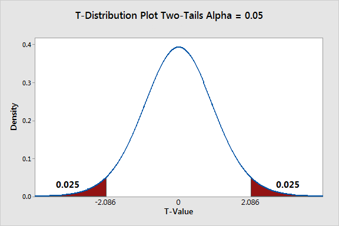

```{r setup, include=FALSE}
library(learnr)
library(gradethis)

knitr::opts_chunk$set(
	echo = FALSE,
	message = FALSE,
	warning = FALSE
)

knitr::knit_engines$set("html") # for linux machines

source("../R/helper_code.R")

# Check whether required packages are installed
pkgs <- matrix(c(
  "learnr", "0.10.5", "CRAN",
  "gradethis", "0.2.8.9000", "rstudio/gradethis",
  "outliertree", "1.8.1-1", "CRAN"
), byrow = TRUE, ncol = 3) |> 
  as.data.frame() |> 
  setNames(c("pkg", "version", "where"))

check_pkgs <- function(.pkgs = pkgs) {
  bootcamp:::check_packages(.pkgs)
}


check_RStudio <- function() {
  bootcamp::check_rstudio_equal_or_larger("2022.07.1", verdict = TRUE)
}

check_R <- function() {
  bootcamp::check_r_equal_or_larger("4.2.1", verdict = TRUE)
}

```

```{css, echo = FALSE}
.tip {
  border-radius: 10px;
  padding: 10px;
  border: 2px solid #136CB9;
  background-color: #136CB9;
  background-color: rgba(19, 108, 185, 0.1);
  color: #2C5577;
}

.warning {
  border-radius: 10px;
  padding: 10px;
  border: 2px solid #f3e2c4;
  background-color: #f3e2c4;
  background-color: rgba(243, 226, 196, 0.1);
  color: #775418;
}

.infobox {
  border-radius: 10px;
  padding: 10px;
  border: 2px solid #868e96;
  background-color: #868e96;
  background-color: rgba(134, 142, 150, 0.1);
  color: #2F4F4F;
}

# # create a horizontal scroll bar when code is too wide
# pre, code {white-space:pre !important; overflow-x:auto}
```

```{html, echo = FALSE}
<style>
pre {
  white-space: pre-wrap;
  background: #F5F5F5;
  max-width: 100%;
  overflow-x: auto;
}
</style>
```


## Introduction

<br>
<br>

You made it to the fourth and final tutorial! Kudos! It's not an easy journey and you are almost there!


In this tutorial we will learn how to deal with experimental data and we will play with the difference between causality and prediction.

Keep climbing the mountain and you will be rock solid ready for the exam!

<br>
<br>


## Checking installation

Before we move on with this tutorial, we first quickly 
make sure you have all of the required packages installed.

### R Version 

You need to have installed a recent R version and this tutorial is going to check it
for you. Please hit the `Run Code` button.

```{r r_check, echo = TRUE, include = TRUE, exercise = TRUE}
check_R()
```


### R Studio Version

You also need to have installed a recent RStudio version.
Let's check by clicking `Run Code`:

```{r rstudio_check, echo = TRUE, include = TRUE, exercise = TRUE}
check_RStudio()
```


### Packages

You need to have a few packages installed. 
Click the `Run Code` to check. 
It will check whether you have the required packages installed and will 
attempt to install any missing packages in case there are any.

```{r package_check, echo = TRUE, include = TRUE, exercise = TRUE}
check_pkgs()
```

ok, we are ready! let's dance!

<br>
<br>


## Shall we take Marketing classes?

Companies that carry out any kind of business need to implement good marketing strategies to propose their products in the most appealing way to their customers. Some people believe that marketing skills are natural to some 'natural born sellers', other people believe that everyone can learn how to be good at marketing. 

If you are a school that teaches to business people marketing strategies, you definitely belong to the second group :)

Let's consider a fictitious school named 'The Good School of Marketing' (GSM). GSM wants to measure the effective impact of its master course 'Best marketing strategies for contemporary business'. They are scientists and believe in the experimental method. Hence they collect data about the 2000 companies with the highest revenue in the country and check whether their CEO attended or not their class. 

Please note, when we talk about experimental method, we have a large array of options. Usually, we call experiment something taking place in a controlled environment such as a lab, where we can control for all the conditions in the room. For instance, we can give some drug to a rat and see whether the drug helps the rat to get to the end of a maze, given the same temperature, humidity rate and food. Even if a so called lab experiment is the most famous type of experiment, it is not the only one. For instance, we have field experiments. Field experiments take place outside of a lab and observe the effect of a treatment (of any kind) on a group to be compared to a control group that did not take the treatment. 


Let's take a look at their data and see what we have here. 

```{r tut04_prepMarketing, echo= FALSE, include = FALSE}

amazon <- bootcamp::amazon
amazon$logo <- as.numeric(amazon$logo)
ma <- amazon[amazon$logo <= 2, ]
marketing <- ma[, -3]
colnames(marketing) <- c("marketing_class", "N_clients", "Online", "N_employees", "MaleCEO")
marketing$marketing_class[marketing$marketing_class == 2] <- 0

```


```{r tut04_01, echo=TRUE, exercise = TRUE, exercise.setup = "tut04_prepMarketing"}
summary(marketing)
```


We have five variables

- `marketing_class`: did the CEO take the marketing class? YES (1), NO (0)
- `N_clients`: number of clients, used as a proxy for marketing strategy success
- `Online`: Type of business. Online (1), Not online (0)
- `N_employees`: number of employees, proxy for company size
- `MaleCEO`: is the CEO male? YES (1), NO (0)


When a company is successful it has a larger network of customers that benefit from its services/products. It is straightforward that if no one wants to use its services/product the company will eventually fail. The network of relationship a company is embedded in is crucial for its survival and well being. Do marketing strategies help the company attracting clients? The literature on the subject and empirical evidence widely support this idea. Then in this case our research question is: Does the master offered by the GSM master help the companies in increasing the number of clients? Given our knowledge about GSM (let's pretend ^_^), we believe so. This belief is our research hypothesis. Let's write it down. 

H1: The master offered by GSM affects the number of clients

H0: The master offered by GSM does not affect the number of clients


Taking the master is our treatment. We compare the treatment group to a control group that did not take the master. In this perspective, this is a field experiment since we are monitoring the effect of a treatment outside of a lab. We cannot control for every condition, as much as in a lab. Still, we collect data on some control variables of relevance (in this case `Online`, `N_employees`, `MaleCEO`) so that we can make sure that what we observe in the experiment is really due to the treatment instead of other conditions that happen by chance. 

In this perspective, our outcome variable is `N_clients` since we want to observe whether `marketing_class` is able to explain its variation. 

In regression terms we have `N_clients ~ marketing_class`

Let's move on step by step. 

## By all `Mean`

When we observe a group of respondents, we cannot possibly analyse the behavior of each one of them. We need to use some measures that are able to communicate in a quick and efficient way what is the population trend. Right? To compare the number of clients of the group of CEO that took the master to the group of CEO that did not take the master, what can we use? Well, statisticians believe that comparing the arithmetic mean the treatment group to the arithmetic mean of the control group is a good way to see if the treatment has effect or not on the number of clients. 

Hence we can say that 

H1: $\mu_1 \neq \mu_0$

H0: $\mu_1 = \mu_0$


In fact, if the null hypothesis is correct and the treatment has no effect, the mean of the two groups are going to be equal.

It does make sense. Right? 


The way we spelled out the difference in mean above is called two sided, or two tailed or bilateral since we are taking into account both positive and negative effects. It is also possible to make assumptions on the direction of the effects, specifying the hypothesis on one side or the other.


If we hypothesize that the mean of the treatment group is different than the mean of the control one, we are not making any assumption concerning the type of effect that the master is producing. Still, we are not only supposing that the effect exist, but also that the effect is positive. 

The GSM school believes that the master helps the companies to increase the number of clients. Hence we can further specify own hypothesis as:

H1: $\mu_1 > \mu_0$

H0: $\mu_1 = \mu_0$


Before we run any kind of statistical test to look for evidence in support of our hypothesis, we should always take a look at the data. 

Run the code below to produce boxplot that show the difference in mean for the N of clients divided into the treatment and control group.

```{r boxplot, echo=TRUE, exercise = TRUE, exercise.setup = "tut04_prepMarketing"}

boxplot(N_clients ~ marketing_class,
        data = marketing,
        main = "Effects of Marketing Class on N clients",
        xlab = "Marketing class", 
        ylab = "N clients")

```


Nice! with this boxplot we can easily see that the averae number of clients is much higher for those companies who's CEOs attended the master! Can you see it? The 1 denotes the boxplot about the treated group, while the 0 is below the boxplot with the control. 

Is this enough to support our hypothesis? I am afraid it is not. In statistics we talk about statistical significance, right? Is our result random, or it is generated by a specific process? AKA, if we repeat the experiment 1000 times, are we going to get the same result? 

Well, let's use a statistical test to check on the significance of our result! 


## Statistically significant 

One of the most common tools to check whether the difference in mean between two groups is statistically significant is the t-test. 

The t-test works with the assumption that both treatment and control groups are sampled from normal distributions with equal variances. Does it ring any bell? Isn't it similar to the linear regression assumption? Well, we will discuss this later...

We can run a t-test in R with the `t.test()` function from the `stats` in built package. 

Explore the function usage typing 

`?stats::t.test` in your console or in the code box below.

We are going to specify the t-test for our hypothesis similarly to a linear regression. Let's try. 


```{r t-test, echo=TRUE, exercise = TRUE, exercise.setup = "tut04_prepMarketing"}

H1test <- stats::t.test(marketing$N_clients ~ marketing$marketing_class, 
                        alternative = "two.sided")

H1test
```

It worked! 


the way we specified the test is checking for the two sided option. 

What can we say about the result? We have a p-value smaller than 2.2e-16. The probability that the difference in mean we observe between the treatment and the control group is by random is very very small. So small, that we can claim that there is evidence in favor of our hypothesis 1. 

The output also provides the confidence interval. We can read a confidence interval alternatively than a p-value. 
We have -269.1029 and -229.7591. These two scores are both negative. A confidence interval shows a significant result when both score are either both positive or both negative. If they have different sign they are considered not significant. 

The output also provides us with the estimated mean for each group. These numbers match with the two tick lines we have observed in the boxplot.

Ok, we have tested the two sided hypothesis. Still, the University believes that their graduates are increasing the number of clients! Shall we test that? 

Can you do it for me? Pretty, pretty please :)

I will help you. Use the code provided above and substitute "two.sided" with "less". It is checking whether the mean of the control group is significantly smaller than the treated one.


```{r testgreater, echo=TRUE, exercise = TRUE, exercise.setup = "tut04_prepMarketing"}


```


```{r testgreater-solution}

H1test <- stats::t.test(marketing$N_clients ~ marketing$marketing_class, 
                        alternative = "less")

H1test


```


```{r testgreater-check}
gradethis::grade_code(correct = "Great job!")
```


Yes! It is significant! Our treatment group has a statistically significant effect in increasing the number of clients! Lovely!

Why don't you try to check on the possibility that the mean of the treated group is higher than the mean of the control group? Same way as above but you need to specify the option "greater". Give it a go!


```{r testless, echo=TRUE, exercise = TRUE, exercise.setup = "tut04_prepMarketing"}


```


```{r testless-solution}

H1test <- stats::t.test(marketing$N_clients ~ marketing$marketing_class, 
                        alternative = "greater")

H1test


```


```{r testless-check}
gradethis::grade_code(correct = "Sweet!")
```


the p-value this time is very high! Hence, we can claim that the Marketing master is not having a negative effect on the companies! Good!


Now that we know how to run the test, shall we also check what does this mean in practice? Yes, I know that at the bottom of your heart you want to :D


Let's take a look at this image




In this image we see the distribution of difference between the mean of the treatment and control group of the same experiment that we are running in real life, reproduced via simulation. Each of the points forming the bell curve is an experiment. In order for our real experiment to be significant, it needs to be either in the red area on the right or on the left. This is what the two-tailed test is looking for. It is less likely to be in one of these two small areas instead of the large space at the center, that's why the p-value needs to be small. The unlikely needs to happen. If our experiment resembles all the random others it does not have much value. 

If we specify 'greater' in the test, we are only looking at the red area on the right hand side of the plot. If we specify 'less' we are only looking at the left one. 


## Linear Regression

As we already learned in the previous classes this week, the linear regression models also analyses how a variable is able to predict the variation of an outcome one given that the outcome is numeric and follows a normal distribution. Linear regression is also checking on the differences between groups of respondents on average. Mathematically, the reasoning behind the t-test and the linear regression is very similar. We can test our experimental hypothesis with the `lm()` function that you know already. 

Shall we try? 

First of all, we need to make sure that the variables have the right dress for the occasion. 

`marketing_class` needs to be recoded as a factor since it is a dummy one denoting the state of having taken or not the master class. 

Then, we can run the model


```{r linear_reg, echo=TRUE, exercise = TRUE, exercise.setup = "tut04_prepMarketing"}

marketing$marketing_class <- as.factor(marketing$marketing_class)

H1lm <- stats::lm(N_clients ~ marketing_class, 
                        data = marketing)

summary(H1lm)
```


The p-value is smaller than 2.2e-16. This is exactly the same result we got with the t-test! waw! Since it is significant we can move on reading the estimate. According to the model those CEOs that took the master are 249.431 more likely than those CEOs who did not to have an increment in the number of clients! This is a fantastic result for the GSM School!

Now we are happy and satisfied, right? No! wait, we have more information! are we absolutely sure that the higher average number of clients in the treatment group has to be attributed to the the treatment? Well, no. We cannot possibly know. 

Since we have control variables, we should include them in the model in order to make sure that they are not the real reason for which we observe this difference in mean. 

Can you do it for me? 

- check the variables' class
- prepare the variables IF needed.
- insert them in the model

tip: run `head(marketing)` to refresh what are the other variables. 

```{r linear_reg2, echo=TRUE, exercise = TRUE, exercise.setup = "tut04_prepMarketing"}

# H1lm1 <-


```


```{r linear_reg2-solution}

class(marketing$Online)
class(marketing$N_employees)
class(marketing$MaleCEO)


H1lm1 <- stats::lm(N_clients ~ marketing_class +
                    Online +
                    N_employees +
                    MaleCEO, 
                  data = marketing)

summary(H1lm1)

```


```{r linear_reg2-check}
gradethis::grade_code(correct = "You are on fire!")
```


Here we are! None of the control variables is significant! Now we can truly claim that the marketing class in the master is super good and makes increase the number of clients! 


## Predicting the Future

What we did so far in this tutorial would be called by the majority of us statistics. Right? Would you call it data science? Well, I don't know what you are thinking right now, but I am pretty sure that you would call data science a predictive model that uses linear regressions. 

Right?


Well, when we enter the world of predictive models we think of machine learning, neural networks, artificial intelligence and so on and so forth. Is it that far? 

When causal inferences approaches look at the reasons why we observe something (are the companies having more clients because their CEOs took the master?), predictive approaches aim at classifying the future behavior into patterns we already know. I know that a large number of people behave this way (training data set), what are other people expected to do (test data set). 

These are two sides of the same coin. 

When we use linear regressions to make prediction, we are assuming that new actions can be classified according to the pattern we already explained. After you establish the causes, you can predict 'the future'! aka, you can see how a new observation lies in the old pattern. 

Let's move on with our example and assume that our `marketing` data set is our training data set and now the university wants to predict the behavior of perspective students. 

Let's start in the most simple way. Let's get back to the first linear model where we only consider our outcome variable `N_clients` and predictor `marketing_class`.  

let's prepare a toy test data set with one entry for marketing_class only. 

`p` is storing  data frame with two entries. Entry one does not take the master, entry two does. 

```{r linear_regPred, echo=TRUE, exercise = TRUE, exercise.setup = "linear_reg"}

p <- data.frame("marketing_class" = as.factor(c(0, 1)))

p

predict(H1lm, newdata = p)
```

We can already tell to one perspective student that according to our model their number of clients will be around

508 if they don't take the master, and around 557 if they do. 

Can we see that these numbers are exactly the mean of the control and the treatment group? 

ahhh how fun is math? ^_^

Ok this model is very basic. Let's make use of all the other info we have by creating a more informative test data set. 

The `p` data frame contains now three entries with full information on the four variables we have. The three entries are offline companies and they all have around 50 employees. Hence we want to see whether being a man and taking the master or not makes a difference. 


```{r lm1, echo=FALSE, exercise = FALSE, exercise.setup = "tut04_prepMarketing" }
H1lm1 <- stats::lm(N_clients ~ marketing_class +
                    Online +
                    N_employees +
                    MaleCEO, 
                  data = marketing)


```


```{r linear_regPred2, echo=TRUE, exercise = TRUE, exercise.setup = "lm1"}

p <- data.frame("marketing_class" = as.factor(c(1,0,1)), 
                                              "Online" = as.factor(c(1, 1, 1)),
                                              "N_employees" = c(50, 50, 50),
                                              "MaleCEO" = as.factor(c(1, 1, 0))) 
p

predict(H1lm1, newdata = p)
```


Given the results we can say that being a woman CEO does not affect the chances of increasing the number of clients. In fact, the third entry is a woman and keeping all the conditions constant has about 7 clients more than her male CEO colleague that also took the master (entry one).


Needless to say, you can estimate these scores manually as we learned in the lab in Day3. 

Machine learning, Neural Networks, AI etc, have more sophisticated ways to make predictions, but they are ultimately using the same mindset that we just discussed here. 

It makes no sense to discuss whether causal inference is more or less data science than prediction as much as it makes to sense to discuss whether fish and chips is less of a food than pizza. 


## The Network Conundrum
